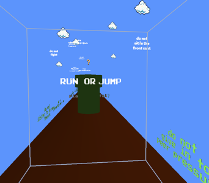

# Ruby CaveWriter

This can generate XML for use in the Brown University Cave. Rather than adding every single object to the Cave environment manually (using an old and difficult-to-navigate UI), I used this tool to create reusable elements that I could add and position in the cave programmatically.

-----------
## Super Childhood Deluxe
#### Final Project for LITR1010: Cave Writing, Brown University

> The user steps into an immersive 3D experience that bears a striking resemblance to a familiar 2D environment: the world of Super Mario. Given the same choices Mario has, running forward and jumping, the user must navigate this world, its dangers, and its rewards. Using an object-oriented Ruby suite for scripting Cave XML, the world of Mario has been recreated within the Cave. But instead of gold coins, players receive unpaid internships. Instead of Goombas, they must vanquish piano recitals. And by contrast with the original game environment, players can see in all directions around them, yet they still only have two choices: run or jump.

Super Childhood Deluxe is an interactive art piece designed for an immersive stereo 3D audiovisual environment known as the Cave.

## Wait, hold on. Cave?

From the Cave Writing website:

> Powered by a high-performance parallel computer, the Cave is an eight-foot cube, wherein the floor and three walls are projected with high-resolution stereo graphics to create a virtual environment, viewed through special “shutter-lens” glasses.

Peer reception:
> … Far from a mere anthropological exploration of childhood at a specific time and under specific circumstances, Super Childhood Deluxe puts its viewers in a position to learn what it's like to see the world through the lens of digital games. While this sensation may be familiar to some, it is of even more worth to those with limited contact with such literature. As gaming and algorithmic dimensions of text become increasingly important, work like Beyer's will help to illustrate (and investigate) just how these new fields affect our collective worldview.
